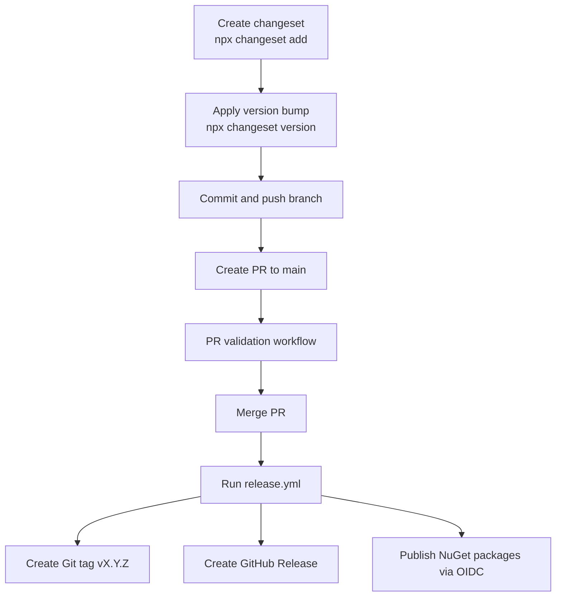

# Release flow

This repository uses a reusable GitHub Actions release architecture with separate PR validation and manual release workflows:

- `.github/workflows/pr.yml`
- `.github/workflows/release.yml`
- `.github/workflows/reusable-dotnet-validate.yml`
- `.github/workflows/reusable-dotnet-pack.yml`

## PR validation

`pr.yml` runs on pull requests targeting `main` and only validates code quality and correctness.

It runs:

1. Node dependency install with detected package manager (`npm`, `pnpm`, or `yarn` lockfile detection)
2. `dotnet restore`
3. `dotnet build --no-restore --configuration Release`
4. `dotnet test --no-build --configuration Release` (with TUnit treenode unit-test filter)
5. publish TRX test results into PR checks and upload raw test artifacts

The PR workflow does not tag, release, or publish packages. It uses read-only permissions by default, with a dedicated test-results publishing job that requests only `checks: write` and `pull-requests: write`.

`reusable-dotnet-validate.yml` always runs tests with a treenode filter. If `test-treenode-filter` is unset or empty, it falls back to:

```text
/*/*/*/*
```

## Changesets and versioning model

`package.json` is the authoritative release version source. The release workflow reads:

```bash
node -p "require('./package.json').version"
```

This flow assumes version prep already happened before release (for example with `@changesets/cli` versioning and changelog updates merged to `main`).

The release workflow does not invent or auto-bump versions.

## Prerelease support

Any SemVer containing a hyphen (`-`) is treated as a prerelease, for example:

- `1.2.3-alpha.0`
- `1.2.3-beta.1`
- `1.2.3-rc.0`

Prerelease versions create GitHub prereleases. Stable versions create standard GitHub releases.

## Simplified deployment process

Use this end-to-end flow for prerelease and stable deployments:

1. Create a changeset:
   - `npx @changesets/cli add --empty --message "<change summary>"`
   - update generated `.changeset/*.md` frontmatter with package bump (for this repo: `"purview-eventsourcing": patch`)
2. Apply version bump/changelog updates:
   - `npx @changesets/cli version`
3. Push to a branch and open a PR:
   - `git push -u origin <branch>`
   - `gh pr create --base main --head <branch> --title "<title>" --body "<body>"`
4. Merge PR to `main` after checks pass:
   - `gh pr merge --squash --delete-branch`
5. Trigger release workflow from `main`:
   - `gh workflow run release.yml --ref main`
6. Workflow handles:
   - tag creation (`v<version>`)
   - GitHub release/prerelease creation
   - package publish to NuGet via OIDC trusted publishing



## Manual release workflow

`release.yml` is `workflow_dispatch` only and enforces release from `main`.

High-level stages:

1. **prepare/guard**
   - verify branch is `main`
   - read version from `package.json`
   - compute `v<version>` tag
   - fail if tag exists on `origin`
   - fail if GitHub Release already exists for the tag
   - extract release notes for the version from `CHANGELOG.md` (fallback note if missing)
2. **validate**
   - restore/build/test through reusable `.NET validate` workflow
3. **pack**
   - pack through reusable `.NET pack` workflow to `artifacts/package` from a configurable solution/project target
4. **guard-nuget-duplicates**
   - inspect every generated `.nupkg` in `artifacts/package`
   - fail if any package ID + version already exists on NuGet
5. **create-release**
   - create and push Git tag (after validate + pack succeed)
   - create GitHub Release and attach `.nupkg`/`.snupkg` artifacts
6. **publish-nuget**
   - OIDC login to NuGet
   - publish all `.nupkg` artifacts from `artifacts/package` to nuget.org

## Duplicate release protection

Before release/publish, duplicate guard checks:

- remote Git tag existence (`git ls-remote --tags origin refs/tags/v<version>`)
- GitHub Release existence (`gh release view v<version>`)
- NuGet package/version existence for each generated package via:
  - `https://api.nuget.org/v3-flatcontainer/<package-id-lower>/index.json`

If any duplicate state is detected, the workflow fails early.

## NuGet Trusted Publishing (OIDC)

This flow uses NuGet Trusted Publishing with GitHub OIDC and **does not use long-lived `NUGET_API_KEY` secrets**.

Publishing job permissions are scoped to:

```yaml
permissions:
  id-token: write
  contents: read
```

The login step is:

```yaml
- name: NuGet login
  uses: NuGet/login@v1
  id: nuget-login
```

The temporary API key output from that step is used with `dotnet nuget push`.

### nuget.org setup requirements

Configure a NuGet trusted publisher policy that matches:

- GitHub owner: `kjldev`
- GitHub repository: `purview-eventsourcing`
- workflow file: `.github/workflows/release.yml`

Keep `release.yml` filename stable after policy setup, because trusted publishing binds to that workflow identity.

## Why API keys are not used

OIDC trusted publishing removes long-lived credential management risk:

- no static NuGet API key secrets in repository settings
- short-lived token exchange at publish time
- scoped, auditable CI identity-based access

## Reusable architecture for other project types

The reusable architecture is intentionally split into generic phases:

1. validate (install/restore, build/validate, test)
2. package (artifact creation)
3. release (guards, tag, release notes, release artifact attach, publish/deploy)

To adapt later:

- NuGet multi-package: add additional pack/publish reusable workflows
- npm package: replace package/publish stage with `npm pack` / `npm publish`
- React/static site: replace package stage with build output artifact and deploy stage
- containerized service: package as image and publish to registry, then deploy

The same guard/tag/release-notes/release orchestration pattern remains reusable.
